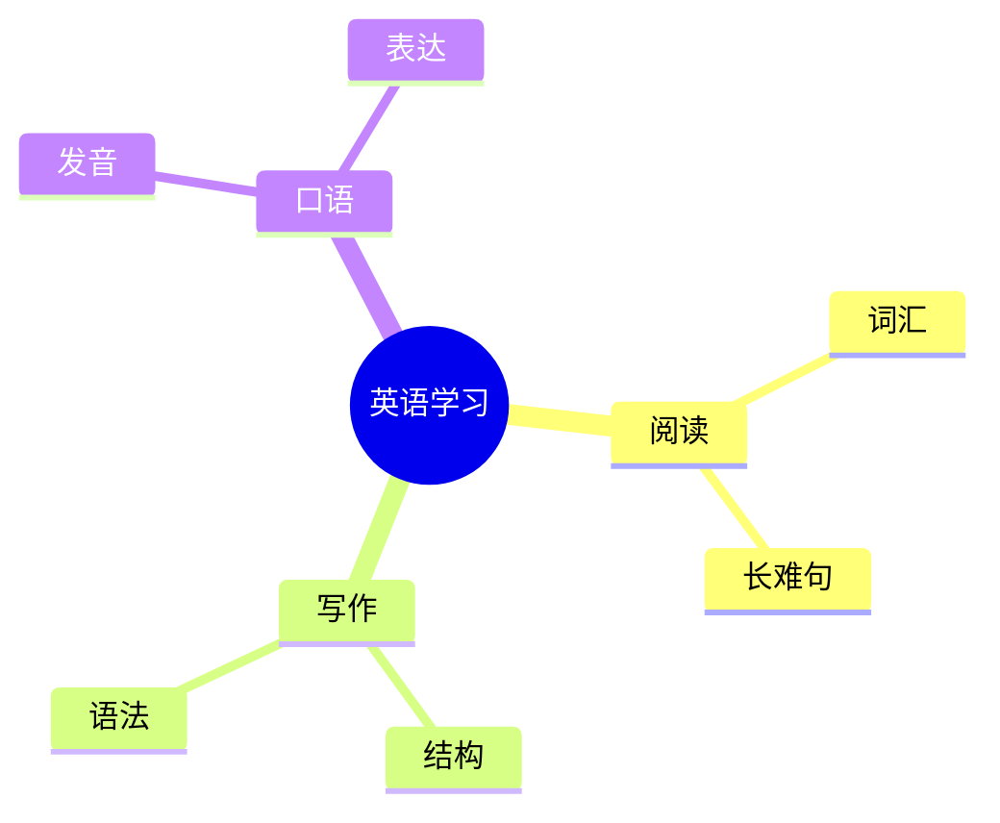

# AI 助手富内容渲染方案：Markdown + Mermaid + D3

## 目标

为 iPadOS 端 AI 助手设计一套可扩展的富内容渲染系统，让大模型回复不再只是纯文本或基础 Markdown，而是能够稳定展示：

- 产品级 Markdown 排版
- 表格、代码块、引用块、链接、图片
- Mermaid 图表与思维导图
- D3 思维树、关系树、知识图谱
- 后续英语学习专属卡片，如作文评分、语法分析、词汇关系

本方案的核心取舍是：**App 仍然保持 SwiftUI 原生架构，只有 AI 回复正文使用 WKWebView 渲染富内容。**

## 已确认技术选择

- **Markdown 渲染容器**：`WKWebView`
- **普通结构图 / 流程图 / 简单 mindmap**：Mermaid
- **高级思维树 / 关系树 / 知识图谱**：D3
- **iPad 原生外壳**：SwiftUI
- **模型输出协议**：Markdown fenced code block + 结构化 JSON

暂不采用 Markmap 作为第一优先级。原因是当前需求已经明确要做 D3 和 Mermaid：Mermaid 足够覆盖简单 mindmap，D3 更适合做产品级关系树和知识图谱。

## 设计原则

### 1. WebView 只负责 AI 回复正文

不要把整个聊天页面变成网页。聊天页面仍由 SwiftUI 负责：

- 左侧导航栏
- 对话列表抽屉
- 顶部模型选择
- 输入框
- 附件上传
- 流式状态
- 消息列表滚动

WebView 只作为 `AssistantRichMessageView` 内部的正文渲染器。

### 2. 模型不直接输出可执行 HTML

模型可以输出 Markdown、Mermaid、JSON，但不能直接输出 HTML/JS 作为最终渲染内容。客户端负责解析、清洗和渲染。

### 3. Mermaid 解决“声明式图”

Mermaid 用于模型容易生成、用户容易理解的声明式图：

- `flowchart`
- `sequenceDiagram`
- `mindmap`
- `timeline`
- `classDiagram`
- 简单学习路径图

### 4. D3 解决“交互式关系图”

D3 不让模型直接写 JS。模型只输出 `graph-json`，客户端用固定 D3 renderer 渲染：

- 思维树
- 关系树
- 知识图谱
- 词汇关系网
- 语法结构关系图
- 阅读文章结构网络

## 整体架构

```text
AssistantMessage.content
  ↓
RichContentParser
  ↓
RichContentBlock[]
  ↓
AssistantRichMessageView
  ↓
MarkdownWebView
  ↓
Local Rich Renderer
    - renderer.html
    - renderer.css
    - renderer.js
    - markdown-it or marked
    - DOMPurify
    - Mermaid
    - D3
  ↓
WKScriptMessageHandler
    - heightChanged
    - linkTapped
    - copyRequested
    - graphFullscreenRequested
```

## 建议目录结构

```text
PersonalEnglishAI/Features/Assistant/RichContent/
  AssistantRichMessageView.swift
  MarkdownWebView.swift
  RichContentBlock.swift
  RichContentParser.swift
  RichContentWebEvent.swift
  RichContentSecurityPolicy.swift

PersonalEnglishAI/Resources/RichRenderer/
  renderer.html
  renderer.css
  renderer.js
  vendor/
    markdown-it.min.js
    dompurify.min.js
    mermaid.min.js
    d3.min.js
```

## 消息输出协议

### 普通 Markdown

模型默认输出 Markdown：

```markdown
# 语法分析

这个句子的核心结构是：

- **主语**：I
- **谓语**：have learned
- **宾语**：English

> 建议：你可以把这个句子改得更自然。
```

客户端渲染为产品级排版，而不是直接显示 Markdown 符号。

### Mermaid 图表

模型输出 fenced code block：

````markdown

````

客户端识别 `mermaid` block 后交给 Mermaid 渲染。

### D3 关系树

模型输出 `graph-json`，而不是 D3 JS：

````markdown
```graph-json
{
  "type": "force-tree",
  "title": "英语学习关系树",
  "nodes": [
    {"id": "root", "label": "英语学习", "group": "core"},
    {"id": "reading", "label": "阅读", "group": "skill"},
    {"id": "vocab", "label": "词汇", "group": "knowledge"},
    {"id": "sentence", "label": "长难句", "group": "knowledge"}
  ],
  "edges": [
    {"source": "root", "target": "reading"},
    {"source": "reading", "target": "vocab"},
    {"source": "reading", "target": "sentence"}
  ]
}
```
````

客户端用固定 D3 renderer 生成可缩放、可拖拽、可全屏查看的关系树。

## RichContentBlock 数据模型

第一阶段可以先在 iPad 端解析字符串，不要求后端立即改结构。

```swift
enum RichContentBlock: Hashable {
    case markdown(String)
    case mermaid(String)
    case graphJSON(String)
}
```

解析规则：

- 普通内容进入 `.markdown`
- ```` ```mermaid ```` 进入 `.mermaid`
- ```` ```graph-json ```` 进入 `.graphJSON`
- 不识别的 fenced code block 保持为 Markdown 代码块

## WebView 渲染策略

### HTML 模板

`renderer.html` 只加载本地 JS 和 CSS：

```html
<html>
  <head>
    <meta name="viewport" content="width=device-width, initial-scale=1.0">
    <link rel="stylesheet" href="renderer.css">
  </head>
  <body>
    <main id="content"></main>
    <script src="vendor/dompurify.min.js"></script>
    <script src="vendor/markdown-it.min.js"></script>
    <script src="vendor/mermaid.min.js"></script>
    <script src="vendor/d3.min.js"></script>
    <script src="renderer.js"></script>
  </body>
</html>
```

### JS 渲染入口

Swift 向 WebView 注入结构化 payload：

```json
{
  "theme": "light",
  "blocks": [
    {"type": "markdown", "content": "# 语法分析\n..."},
    {"type": "mermaid", "content": "mindmap\n  root((英语学习))..."},
    {"type": "graph-json", "content": "{...}"}
  ]
}
```

JS 渲染完成后回传高度：

```js
window.webkit.messageHandlers.richContent.postMessage({
  type: "heightChanged",
  height: document.body.scrollHeight
});
```

## UI 体验规则

### Markdown 正文

- 最大宽度跟聊天阅读列一致
- 段落行高更舒适
- 标题分级明显，但不要像网页文章那样过大
- 列表缩进稳定
- 引用块使用浅背景和左侧竖线
- 表格横向滚动
- 代码块使用等宽字体、浅背景、语言标签和复制按钮

### Mermaid

- 默认嵌入消息正文
- 图表区域有轻边框和圆角
- 支持点击全屏
- 渲染失败时显示错误卡片和原始 Mermaid 代码

### D3 关系树

- 默认展示为一张可交互图卡
- 支持拖拽节点
- 支持缩放和平移
- 支持全屏查看
- 节点样式区分类型，例如核心、技能、知识点、例子
- 渲染失败时显示错误卡片和原始 JSON

## 安全边界

必须遵守：

- WebView 不持有 token。
- 不允许模型输出的 HTML 直接执行。
- Markdown 转 HTML 后必须经过 DOMPurify。
- JS/CSS/vendor 库全部从本地 bundle 加载。
- 禁止加载远程脚本。
- `WKNavigationDelegate` 拦截未知跳转。
- 链接点击交给 SwiftUI 层处理，可选择外部浏览器或内置安全页面。
- JS bridge 只开放白名单事件：
  - `heightChanged`
  - `linkTapped`
  - `copyRequested`
  - `graphFullscreenRequested`
  - `renderError`

## 性能策略

WebView 比原生 SwiftUI 重，所以需要限制使用方式：

- 只在 assistant 消息中使用。
- 用户消息继续用 SwiftUI `Text`。
- 高度变化需要缓存，避免滚动时反复计算。
- 长对话中只渲染可见消息。
- 流式输出时可以先用轻量文本显示，消息完成后再切换到 WebView 完整渲染。
- Mermaid 和 D3 图表只在消息完成后渲染，避免每个 token 都触发重绘。

## 实施阶段

### Phase 1：产品级 Markdown + Mermaid

目标：让 AI 回复立即具备成熟产品观感。

- 新增 `AssistantRichMessageView`
- 新增 `MarkdownWebView`
- 新增本地 renderer HTML/CSS/JS
- 支持 Markdown 基础排版
- 支持表格横向滚动
- 支持代码块样式和复制按钮
- 支持链接点击事件
- 支持 `mermaid` fenced block
- 支持 WebView 高度自适应
- 接入现有 `MessageBubbleView`

验收标准：

- AI 回复中的 Markdown 不再显示原始符号。
- Mermaid mindmap 能正常渲染。
- 表格和代码块有产品级样式。
- 链接点击不会在 WebView 内任意跳转。
- 全量测试通过。

### Phase 2：D3 思维树 / 关系树

目标：支持高级思维树和知识关系图。

- 新增 `graph-json` fenced block 解析
- 新增 D3 force/tree renderer
- 支持节点拖拽
- 支持缩放和平移
- 支持全屏查看
- 支持图表渲染错误降级
- 建立模型输出 prompt 约束，让模型输出 `graph-json`

验收标准：

- `graph-json` 可以渲染成关系树。
- 节点和边展示清晰。
- 错误 JSON 不会导致页面崩溃。
- 图表可以全屏查看。

### Phase 3：学习专属结构化组件

目标：从“通用富内容”升级到“英语学习产品能力”。

- 作文评分卡
- 语法分析卡
- 词汇关系卡
- 学习计划卡
- 阅读结构图
- 错题知识树

这些组件建议使用结构化 JSON，而不是 Markdown 拼接。

## 非目标

当前阶段不做：

- 整个聊天页面 Web 化
- 远程加载 JS 插件
- 让模型直接输出 D3 JavaScript
- 任意 HTML 执行
- K 线图
- Mermaid/Graph 编辑器
- 多人协作画布

## 测试策略

### 单元测试

- `RichContentParserTests`
  - 普通 Markdown 解析
  - Mermaid block 解析
  - graph-json block 解析
  - 未知 code block 保持 Markdown

### UI / 集成测试

- AI 回复显示 Markdown
- Mermaid 图表显示成功态
- Mermaid 错误显示降级态
- D3 graph-json 显示成功态
- WebView 高度变化不会遮挡后续消息

### 安全测试

- `<script>` 被清洗
- `javascript:` 链接被阻止
- 外部链接走 Swift 层处理
- WebView 不访问 token

## 成功标准

- AI 回复视觉上接近成熟 AI Chat 产品。
- Markdown、Mermaid、D3 的职责边界清晰。
- 简单图使用 Mermaid，高级关系树使用 D3。
- 后续扩展作文评分卡、语法卡、知识树时不需要重构聊天页。
- 用户可以在 iPad 上自然阅读、查看、放大和复制 AI 生成的富内容。
