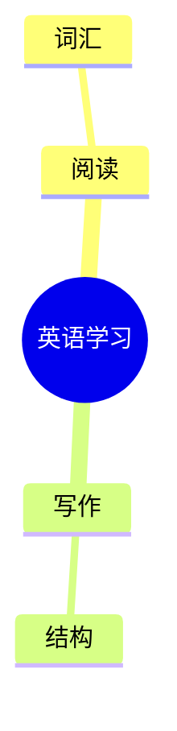

# iPadOS AI 助手富内容渲染 Trae 题目

参考文档：

```text
docs/superpowers/specs/2026-06-15-assistant-rich-content-rendering-design.md
```

目标：让 iPadOS AI 助手回复支持产品级 Markdown、Mermaid 图表和 D3 思维树。App 主体仍用 SwiftUI，只把 AI 回复正文交给 `WKWebView` 渲染。不改后端。

---

## A1：实现 Markdown WebView 富文本渲染

标签：困难 / feature迭代 / 前端

### Prompt

请在 iPadOS SwiftUI 项目中新增 AI 回复富内容渲染框架。用户消息继续用 SwiftUI，AI 回复正文改为 `WKWebView` 渲染。

建议新增：

```text
PersonalEnglishAI/Features/Assistant/RichContent/
  AssistantRichMessageView.swift
  MarkdownWebView.swift
  RichContentBlock.swift
  RichContentParser.swift

PersonalEnglishAI/Resources/RichRenderer/
  renderer.html
  renderer.css
  renderer.js
  vendor/
```

### 要求

- 支持 Markdown 标题、段落、加粗、列表、引用块、表格、代码块、链接。
- WebView 只能加载本地 HTML/CSS/JS。
- Swift 向 WebView 传结构化 payload，不直接拼接未转义 HTML。
- WebView 回传内容高度，SwiftUI 根据高度展示消息。
- 链接点击回传 Swift 层处理。
- 保留 AI 消息 loading / failed 状态。

### 验收标准

- AI 回复不再显示原始 `#`、`**`。
- 表格可横向滚动。
- 代码块有独立样式。
- 链接不会在 WebView 内任意跳转。
- iPad 模拟器构建通过。

---

## A2：支持 Mermaid 图表

标签：困难 / feature迭代 / 前端

### Prompt

请在 A1 基础上支持 Mermaid fenced code block。模型输出：

````markdown

````

需要渲染成 Mermaid 图表，而不是普通代码块。

### 要求

- `RichContentParser` 识别 ```` ```mermaid ````。
- 支持 `flowchart`、`sequenceDiagram`、`mindmap`。
- Mermaid 使用本地 JS 库渲染。
- 图表有圆角、边框、内边距。
- Mermaid 渲染失败时显示错误卡片和原始源码。
- 渲染完成后更新 WebView 高度。

### 验收标准

- Mermaid `mindmap` 和 `flowchart` 可显示。
- Mermaid 语法错误不会白屏。
- 普通代码块不被误识别。
- 现有 Markdown 渲染不回退。

---

## B1：支持 D3 graph-json 思维树

标签：困难 / feature迭代 / 前端

### Prompt

请支持 `graph-json` fenced code block。模型只输出 JSON，不输出 D3 JS。客户端用固定本地 D3 renderer 渲染思维树/关系树。

示例：

````markdown
```graph-json
{
  "type": "force-tree",
  "title": "英语学习关系树",
  "nodes": [
    {"id": "root", "label": "英语学习", "group": "core"},
    {"id": "reading", "label": "阅读", "group": "skill"},
    {"id": "vocab", "label": "词汇", "group": "knowledge"}
  ],
  "edges": [
    {"source": "root", "target": "reading"},
    {"source": "reading", "target": "vocab"}
  ]
}
```
````

### 要求

- `RichContentParser` 识别 ```` ```graph-json ````。
- 使用本地 D3 渲染 `force-tree`。
- 节点显示 `label`，边连接 `source` 和 `target`。
- 支持缩放、平移、拖拽节点。
- JSON 错误或边引用不存在节点时显示错误卡片。
- 禁止执行模型输出的 JS。

### 验收标准

- 示例 `graph-json` 能渲染为关系树。
- 节点和边展示清楚。
- 图表可缩放、平移、拖拽。
- 错误 JSON 不会导致崩溃。

---

## B2：补齐安全边界和测试

标签：困难 / 工程化 / 前端

### Prompt

请为 AI 富内容 WebView 补齐安全边界、测试和文档回归。

### 要求

- WebView 不持有 token 或服务端 secret。
- 禁止远程脚本加载。
- Markdown 转 HTML 后清洗危险内容。
- 阻止 `<script>` 和 `javascript:` 链接。
- JS bridge 只开放白名单事件：`heightChanged`、`linkTapped`、`copyRequested`、`graphFullscreenRequested`、`renderError`。
- 增加 `RichContentParserTests`：Markdown、Mermaid、graph-json、未知 code block。
- 更新文档说明 WebView、Mermaid、D3 的职责边界。

### 验收标准

- Parser 测试通过。
- 恶意脚本不会执行。
- 外部链接由 Swift 层处理。
- WebView 无 token 注入。
- `xcodebuild test` 或等价测试通过。
